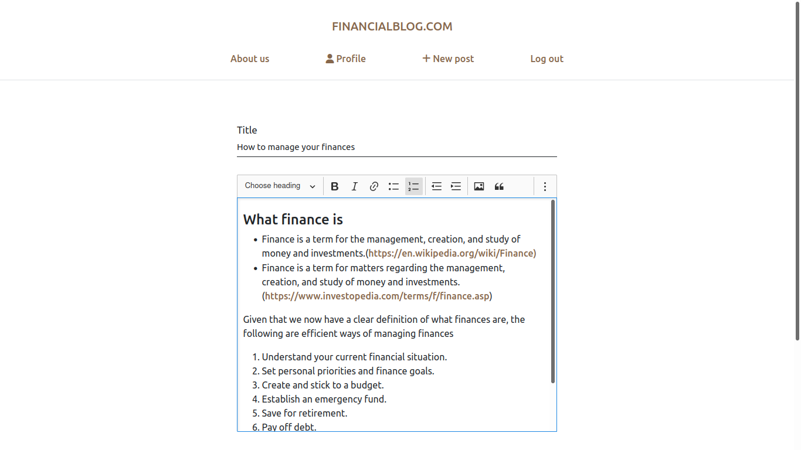

# Financial blog application

***
## Previews
> [Click here](https://) for live demo
>
> 
>
> 

## Info
This is the backend repository of the application.\
[Link to frontend repository](https://github.com/joshua530/financial-blog-frontend)

## Description
A financial blog application that enables people to share financial ideas\
Signed in users are able to:
- view other user's posts
- create, view and delete their posts
- comment on other user's posts

Anonymous users on the other hand are only able to view posts and read comments.

## Usage
##### Prerequisites
- npm (**Ensure nodejs is installed. Installation instructions can be found [here](https://nodejs.org/en/download/) for mac, windows and linux**)
- .env file with the following configurations:
  - `SECRET_KEY` - for generating tokens
  - `DB_URI` - mongodb server uri
  - `ENVIRONMENT`(optional) - defaults to 'development'
  - `PORT`(optional) - defaults to 8000
  - **the .env file should be placed in the project root**

##### Running the project
Clone the repository\
Open terminal or command line\
Change directory to the project's root. Type `cd <project root>` and press enter\
Run `npm install`\
Run `npm run start`

## Technologies used
1. node js - express framework for the backend api
2. react js for the frontend
3. redux
4. mongodb for the database
5. authentication is JWT based
